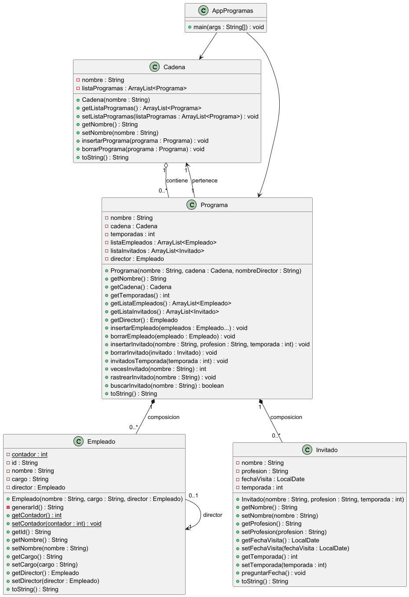

# Práctica 1: El Formiguero y la Rebelion

---

## Contenido
1. [Descripción](#descripción)
2. [Estructura del proyecto](#estructura-del-proyecto)
3. [UML](#uml)

---

## Descripción
El programa cuenta con las clases:

- `Cadena`: Gestiona la lista de programas de la cadena de TV.
- `Programa`: Gestiona empleados e invitados de un programa.
- `Empleado`: Modela los empleados del programa.
- `Invitado`: Modela los invitados del programa.

La clase `AppProgramas` funciona como **main** para probar todas las funcionalidades.

---

## Estructura del proyecto
- `AppProgramas.java` → Main para ejecutar el programa.
- `Cadena.java` → Gestión de la lista de programas.
- `Programa.java` → Gestión de empleados e invitados.
- `Empleado.java` → Creación y modelado de empleados.
- `Invitado.java` → Creación y modelado de invitados.

---

## UML

---

